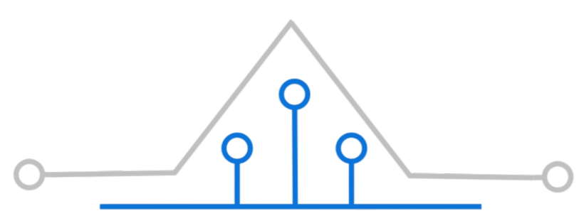
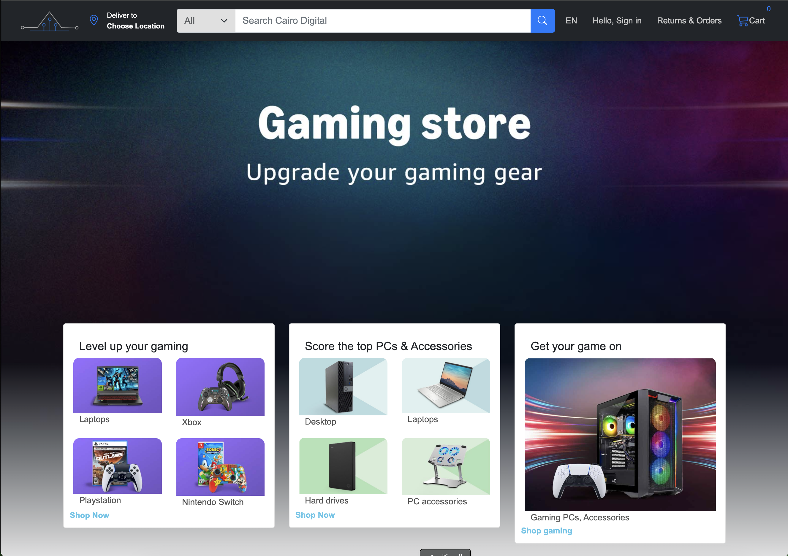

# Cairo-Digital

This project is a digital platform for selling products.

## Features
- User-friendly interface
- Responsive design

Cairo Digital

Cairo Digital is an e-commerce platform designed for selling electronics like PCs, laptops, and gaming consoles. It offers live search filtering, a detailed cart system, personalized checkout options, and product recommendations. The website ensures a seamless shopping experience with a responsive design.

Features

	•	Responsive design for all devices.
	•	Product search with real-time filtering.
	•	Detailed product pages with descriptions, images, and reviews.
	•	Secure checkout with multiple payment options.
	•	Language, currency, and country selection for personalization.

Installation

	1.	Clone the repository:

git clone https://github.com/YOUR_USERNAME/Cairo-Digital.git

	2.	Navigate to the project directory:

cd Cairo-Digital

	3.	Install dependencies:

npm install

	4.	Start the development server:

npm start

Usage

	•	Browse products, search, and filter them easily.
	•	Add products to your cart and proceed to checkout.
	•	Use personalized checkout with secure payment options.

Contribution

This project is a student assignment for ITI and is not open for contributions.

Contact

For any inquiries, please email: Proam.email@gmail.com.
